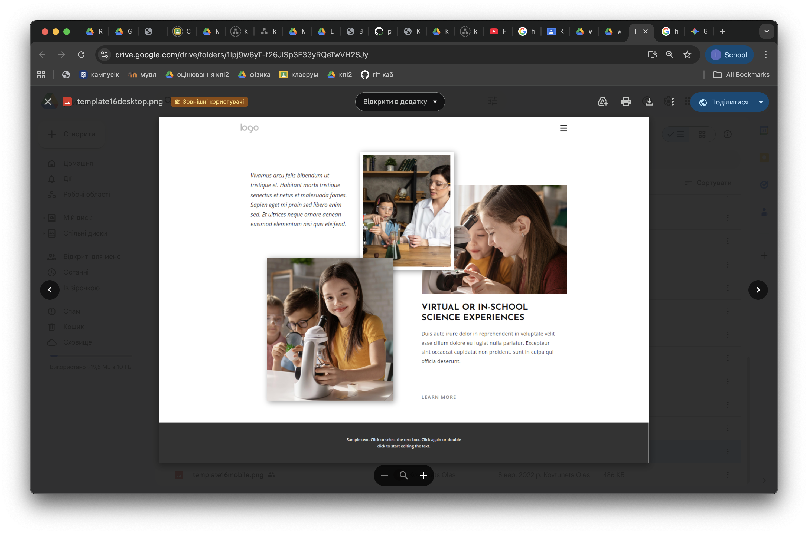
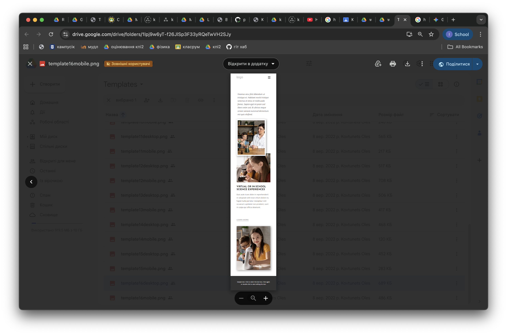
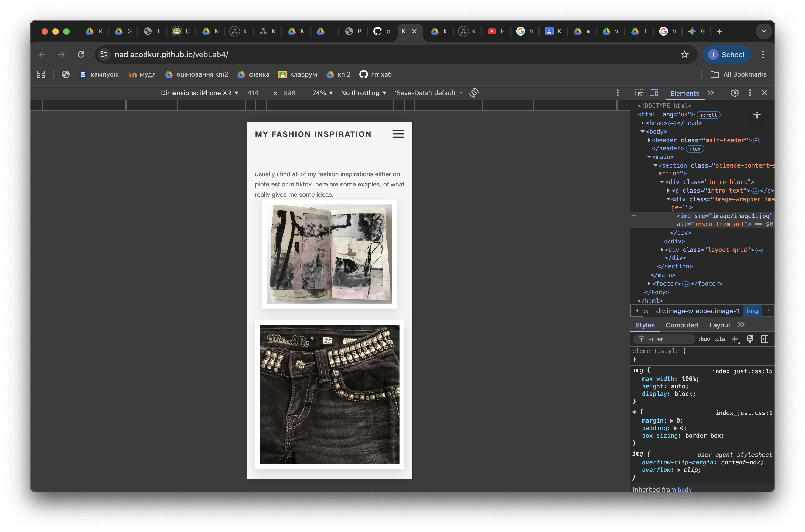
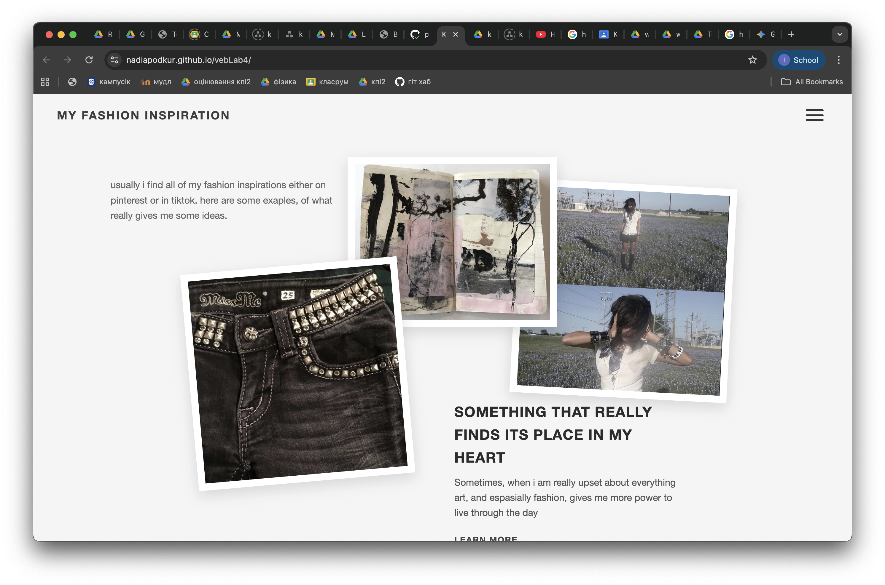

# Лабораторна робота №4

## Виконала: Надія Подкур
## Варіант: 16
## Тема: Верстка вебсторінки на основі графічного дизайну
## Мета роботи: Набуття навичок верстки вебсторінок із підготовлених графічних макетів дизайну вебсторінки.
## Посилання на результат: https://nadiapodkur.github.io/vebLab4/

---

## 1. Вибір варіанта та Структура HTML-документа

* Було обрано **Варіант 16** відповідно до порядкового номера у списку групи.
* Ознайомлення з графічними макетами: `template16desktop.png` та `template16mobile.png`.

Проте, я змінила тематику сторінки, щоб мені було веселіше обирати картинки
* Структура HTML-документа розроблена з використанням **семантичних тегів** та підходу **Mobile-First**:

    | HTML-Елемент | Призначення |
    | :--- | :--- |
    | **`<header>`** | Містить логотип та елементи адаптивної навігації (меню-бургер). |
    | **`<main>`** | Основний вміст сторінки. |
    | **`
`** | Контейнер для складної сітки. Використовує `position: relative` та **абсолютне позиціонування** (`position: absolute`) у медіа-запиті для десктопу для реалізації ефекту перекриття елементів. |
    | **`
`** | Окремий контейнер для кожного зображення, необхідний для застосування стилів (`box-shadow`, `transform`). |
    | **`
` / `
`** | Текстові блоки. |
    | **`<footer>`** | Службовий вміст. |

---

## 2. Графічні Елементи та Обґрунтування Формату

Для підготовки контенту всі фотографії були вирізані в повному розмірі, незважаючи на перекриття текстом.

| Елемент | Формат | Обґрунтування вибору |
| :--- | :--- | :--- |
| **Фотографії контенту** (джинси, дівчина в полі, арт-інспірація) | **JPG** | Оптимальний для фотографічних зображень зі складними кольоровими переходами. Забезпечує малий розмір файлу при прийнятній якості для швидкого завантаження. |
| **Логотип, Іконка меню** | **SVG** | Векторний формат, що гарантує чіткість і відсутність пікселізації при будь-якому масштабуванні. |

---

## 3. Елементи, Візуалізовані засобами CSS

Решта елементів графічних макетів була візуалізована виключно засобами CSS, що мінімізує кількість графічних файлів:

* **Типографіка:** Шрифти, розміри, жирність та колір для всіх заголовків, абзаців та посилань.
* **Структура та Відступи:** Використання `margin: auto` та `padding` для **центрування контенту на мобільному** та точні `top/left/z-index` для позиціонування на десктопі.
* **Декоративні Ефекти:** Тіні (`box-shadow`) та трансформації (`transform: rotate`) для імітації "паперового" ефекту перекритих зображень.

---

## 4. Активні Елементи та Візуалізація Станів

На вебсторінці визначено посилання, для яких продумана візуалізація станів засобами CSS:

* **Посилання "LEARN MORE"**:
    * **Стан `:hover`**: Зміна кольору тексту та межі підкреслення (`border-bottom`) для візуального відгуку користувача. Використано властивість `transition` для плавного ефекту.
* **Кнопка Меню (`.menu-toggle`)**:
    * **Стан `:active` / `:hover`**: Спроектована для подальшого підключення JavaScript, але візуальний стиль забезпечує чіткість і відгук при наведенні/натисканні.

---

## 5. Результат Верстки та Функціонування

Верстка виконана за принципом **Mobile-First** з використанням медіа-запитів (`@media`) для адаптації:

* **Mobile-Layout (Смартфон)**: Вертикальне, центроване розташування контенту.

* **Desktop-Layout (Ноутбук)**: Складний макет з елементами, що перекриваються, реалізований за допомогою `position: absolute` та `z-index`.

Коректне функціонування зверстаної вебсторінки на двох типах екранів продемонстровано та опубліковано за посиланням вище.
